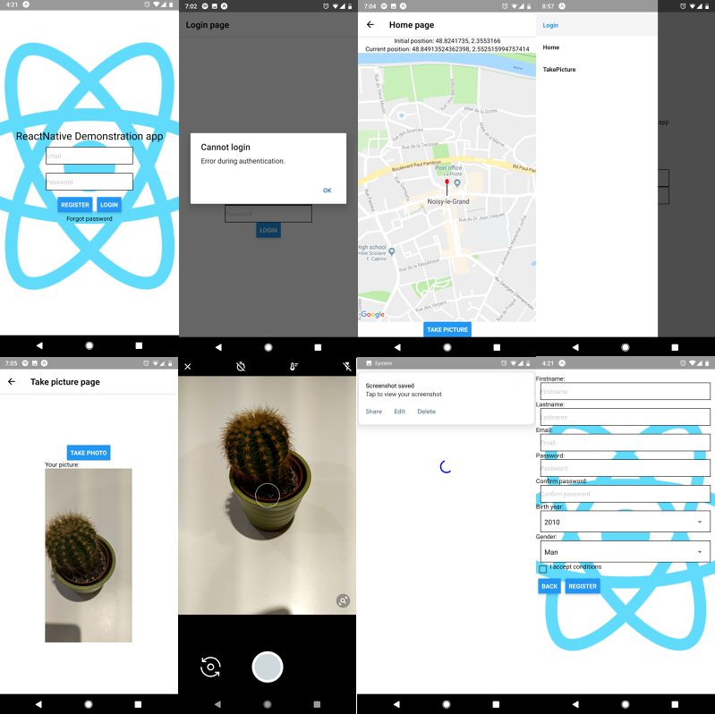

# react-native-demo

A simple React Native demonstration project.



## Start the project

```sh
vagrant up
```

## Connect to the development environment

```sh
vagrant ssh
```

## Start the project

Into the project directory:

```sh
npm start
```

## Install some requirements

```sh
npm install expo
npm install --save react-native-navigation
npm install react-native-maps --save
npm install react-native-camera --save
react-native link react-native-camera
```
